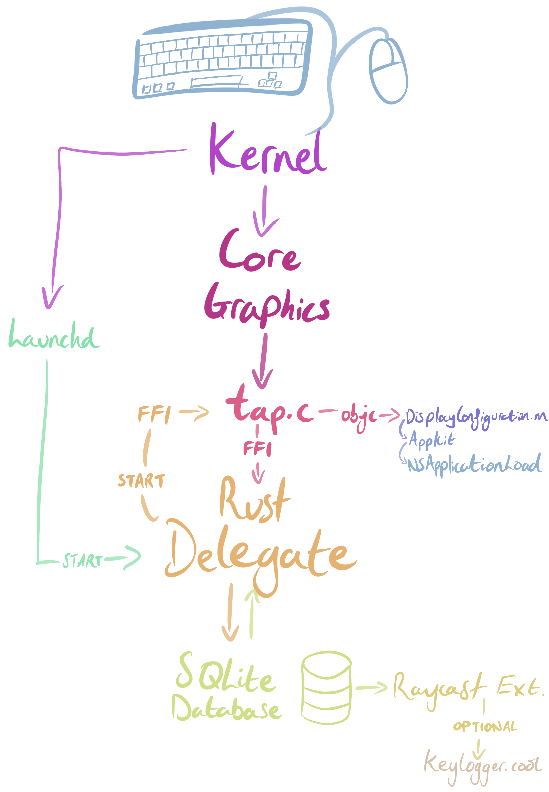

## Ethical keylogging

With the rising popularity of end-of-year summaries à la Spotify wrapped, I thought it would be interesting to do something similar.
This tool collects very granular data about how you type & click.
It stores this data in such a way that it can not be replayed by an attacker.

I will be running this tool for all of 2024 to get a year in review of my typing habits; you should too!
(You will not notice a delay in typing; profiling puts the extra delay at around 20μs.)

### Control flowchart

<picture>
  <source media="(max-width: 700px)" srcset="assets/flowchart.png" width="100%">
  <source media="(min-width: 701px)" srcset="assets/flowchart.png" width="50%">
  
</picture>

### Documentation
Every keypress is inserted into an in-memory staging database. Even though these are in order,
